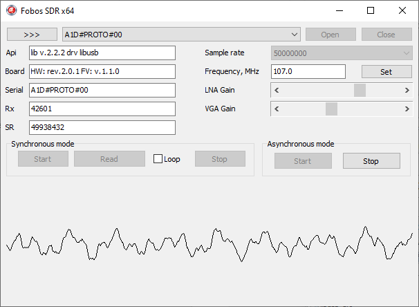

# libfobos-delphi
Fobos SDR API library Delphi wrapper and example test application

## Platforms tested on

- Windows (7, 8.1, 10, 11) x86, x64

## Requirements

- git v.2.31 or later (otherwise download the repository manualy: Code->Download ZIP)
- Deplhi 7 or later (**Fobos.pas**)
- DelphiXE2 (test application)  

## Dependencies

- libfobos v2.2.2

## How to build and evaluate

git clone [this repo] 
open **FobosSDR.dpr** or **FobosSDR.dproj** with the Delphi IDE 
build, run evaluate 

## How it looks like

 

## What is actually Fobos SDR

For more info visit the main product page

https://rigexpert.com/en/products/kits-en/fobos-sdr/
